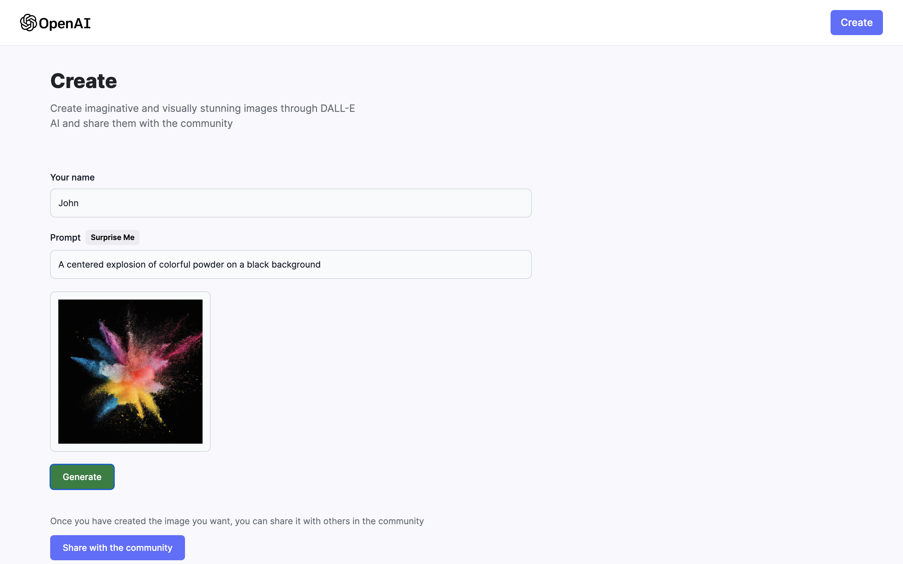

# DALL-E Clone

## Table of contents

- [Introduction](#introduction)
- [Demo](#demo)
- [Technology](#technology)
- [Features](#features)
- [Run](#run)

## Introduction

Welcome to the DALL-E Clone project, an innovative web application that harnesses the power of artificial intelligence to generate and share stunning images. With an impressive stack of technologies including React.js, Tailwind.css, Node.js, MongoDB, OpenAI, and Express.js, this project brings cutting-edge AI capabilities to the world of creative expression.

## Demo

## Technology

The main technologies used to build this application are:

- React.js: Building dynamic and interactive user interfaces with ease.
- Tailwind.css: Styling components efficiently with a utility-first approach.
- Node.js: Enabling server-side scripting and event-driven architecture.
- MongoDB: Storing and managing image data and user-generated content.
- OpenAI: Integrating state-of-the-art AI models for image generation.
- Express.js: Facilitating server setup and REST API creation.
- Cloudinary: Seamlessly managing and optimizing images for a seamless user experience.

## Features

- AI-Generated Images: Experience the magic of AI-powered image generation. Users can create their own unique images by providing prompts to the OpenAI model.

- Community Sharing: Share your AI-generated images with the community. See your creations featured alongside others' in a beautifully designed grid view on the main page.

- Prompt Insight: Hover over each image to discover the prompt that inspired its creation. Gain insights into the creative process behind every masterpiece.

- Download Images: Instantly download any AI-generated image from the main page. Whether it's your own creation or someone else's, the platform makes it easy to collect and cherish the artwork.

## Run

Experience the magic of creating AI images by visiting the deployed project website: http://dall-e.free.nf/